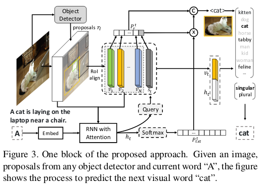

# Neural Baby Talk

> [paper](http://openaccess.thecvf.com/content_cvpr_2018/CameraReady/0205.pdf) 
> [arxiv](https://arxiv.org/abs/1803.09845)
> [code](https://github.com/jiasenlu/NeuralBabyTalk)

## TLDR

This CVPR2018 paper introduces a new framework for image captioning that first generates a sentence template with slot locations explicitly tied to specific image regions and then fills the slots by visual concepts identified in the regions by objects detectors.

## Aim

> objectives, contributions

The paper proposes an architecture that is end-to-end differentiable and is able to circumvent the frequent issue of language models that directely reproduce training data captions.

Neural Baby talk produces natural language explicitly grounded in entities found by object detectors.

Using this framework, one can think of and apply any object detectors in the vision pipeline.

## Methods

> whats new in their approaches

* The approach is not limited to any pre-specified bank of templates. The number of possibly generated templates is exponential.

* FasterRCNN is used for regions extraction.
* RNN using LSTM decoder modules and convolution feature maps as input are used to generates the caption template.
* The slots are filled using the outputs of an object detection network.
* Filling the slots can be refined by:
  1. Determining the plurality
  2. Determining the fine-grained class
This is typically done by 2 single layer MLP with ReLU activations. 


## Technical details

> mathematical notations, proofs

The objective function that is minimized is a cross entropy loss where the probabilities can be decomposed in the textual word probability and the averaged target region probability multiplied by the caption refinement.

> setups

* The sequence of words $$y = \{y_1, \ldots, \y_T\}$$ is generated by introducing a latent variable $$r_t$$ to denote a specific image region so that the word $$y_t$$ can explicitly ground in it.

* Since textual words are not tied to specific regions in the image, a *visual sentinel* is added $$\tilde{r}$$ as a latent variable to serve as dummy grounding for the textual word.


> parameterizing

* Visual words in a caption are dynamically identified by matching the base form of each word (using Stanford lemmatization toolbox) against a vocabulary of visual words).

## Experiments - results

> comparable experiments on typical dataset/environments...

* Flicker30k contains 2,587 unique words. By retaining visual words that occur more than 100 times as detection labels, there are 460 detection labels in the final set.
* COCO has 80 categories with 413 fine-grained classes.

* The authors introduce the Neural Baby Talk oracle model that provides the ground truth object region and category during test time. This hints that the method could further benefit from improved object detectors.

* A robust image captioning dataset is made by looking at the distribution of co-occurring objects in the data. To assess the compositionality of the model, distribution of co-occurring objects in the training set ought to be different from the testing set. In practice, starting from the last co-occurring pairs, we greedily add them to the test set and ensure that for each category at least halft the instances of each category are in the train set.

* A new metric is introduced for novel object captioning since the model is able to directly fill the *slotted* caption template with the concept. Here the goal is to produce description for out-of-domain images.


> breakthroughs

* SOTA on most tasks.


## My thoughts and takeaways

> pros

* Aims to improve compositionality and proves it by designing tailored experiments.
* Use what is known the perform well: vision pipeline.


> cons


> related stuff

## Top Figures

> 

## Metadata

> easily grep-able data: tags, reading depth

> bibtex: author list, title, published year, journal, URL, etc
```
@inproceedings{Lu2018NeuralBT,
  title={Neural Baby Talk},
  author={Jiasen Lu and Jianwei Yang and Dhruv Batra and Devi Parikh},
  booktitle={CVPR},
  year={2018}
}
```
